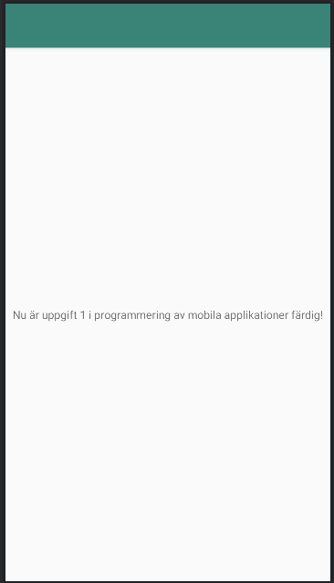

# Rapport

**Skriv din rapport här!**

Jag har forkat github repot mobilapp-programmering-hello. Det innebär att jag skapar en egen version
av koden till mitt githubrepo som jag kan göra ändringar i utan att påverka koden i det huvudsakliga 
repot.

Jag clonade koden till min dator för att hämta hem en lokal version av koden. Jag gjorde ändringar
i texten och skrev "git add" i terminalen för att se till att alla filer ligger med i 
versionshanteringen. Nästa kommando i terminalen va "git commit -m 'beskrivning'" för att göra en 
ny version av programmet med en beskrivning av vad som är gjort. Slutligen skrev jag "git push" för 
att skicka filerna till github.

Man kan ändra strängen nedan för att ändra vad som skrivs ut på skärmen.
```
<resources>
    <string name="app_name">Nu är uppgift 1 i programmering av mobila applikationer färdig!</string>
</resources>
```



